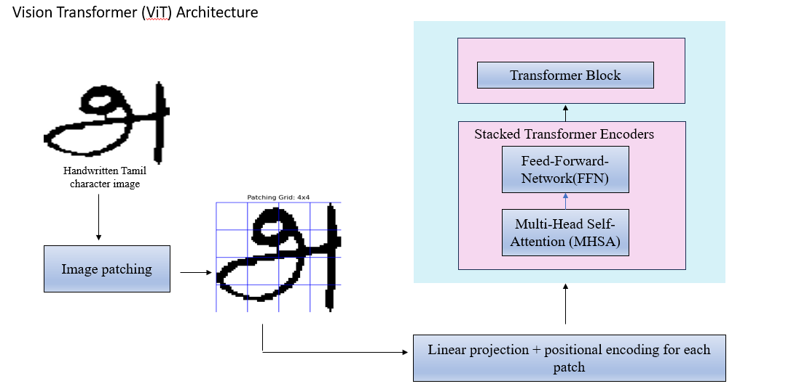
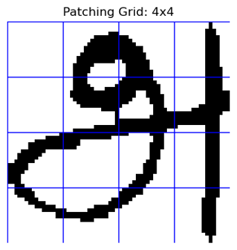
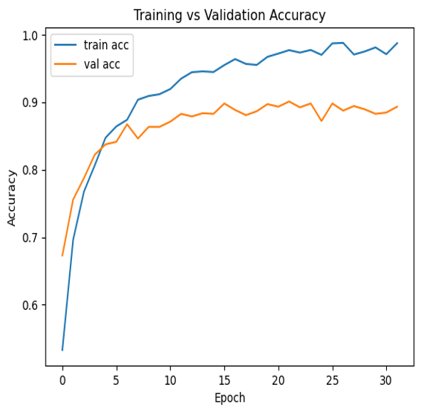
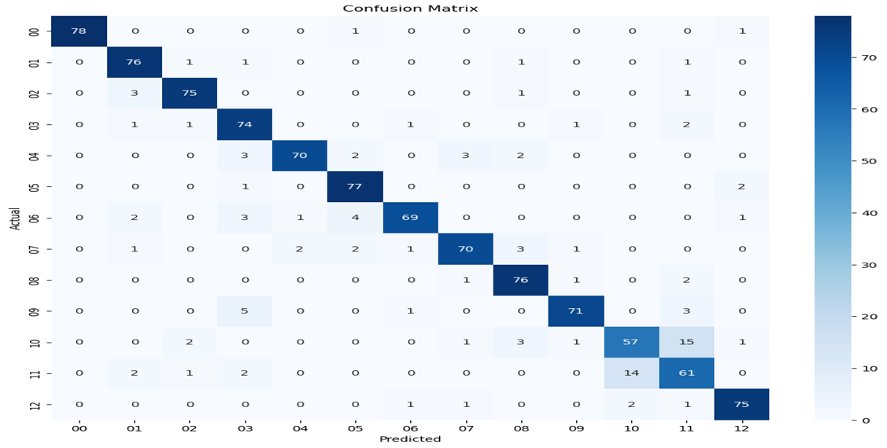
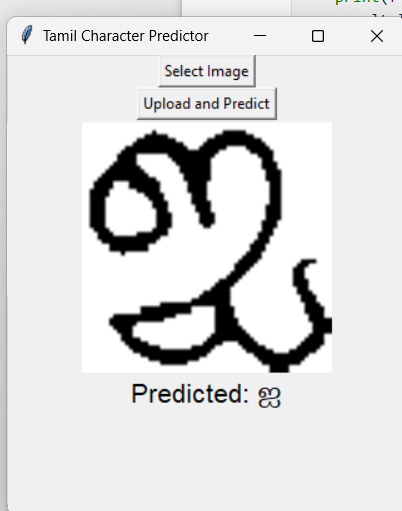
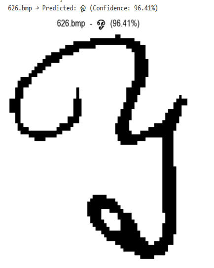
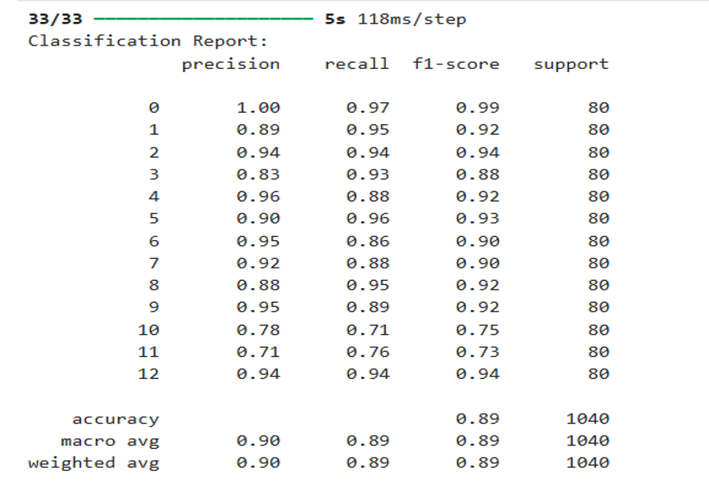

# Tamil-OCR-using-ViT


<h1 align="center"> Vision Transformer-based Tamil handwritten character recognition</h1>

<p align="center">
  <b>Deep Learning • OCR • Vision Transformer</b>
</p>

<p align="center">
  
  
  
</p>

---

##  Abstract
Tamil handwritten character recognition is a challenging problem due to the structural complexity of the script and variability in writing styles. Traditional Convolutional Neural Network (CNN)-based approaches rely on local feature extraction and often fail to capture global dependencies effectively.

This project proposes a **Vision Transformer (ViT)-based approach**, where handwritten Tamil character images are divided into patches and processed using self-attention mechanisms. The model captures both **local and global features**, improving recognition accuracy. The system is evaluated using metrics such as **accuracy, precision, recall, and F1-score**.

---

##  Problem Statement
Tamil handwritten character recognition remains difficult due to:
- High variation in writing styles  
- Complex character structures  
- Limitations of CNN-based models  

This project aims to **improve accuracy and efficiency** using Vision Transformers and reduce dependency on heavy preprocessing.

---

##  Architecture

<p align="center">
  
</p>

---

##  Image Patching

<p align="center">
  
</p>

- Image resized to **64 × 64**
- Divided into **4 × 4 patches**
- Each patch size: **16 × 16 pixels**
- Helps extract features like curves, loops, and strokes

---

##  Methodology

###  Preprocessing
- Convert image to grayscale  
- Resize to 64×64  
- Normalize pixel values  

---

###  Patch Embedding
- Flatten each patch  
- Apply linear projection  
- Add positional encoding  

---

###  Transformer Encoder
- Multi-Head Self-Attention (MHSA)  
- Feed Forward Network (FFN)  
- Residual connections + Layer Normalization  

---

###  Classification
- Global Average Pooling  
- Fully connected layer  
- Softmax output  

---

##  Results

###  Accuracy Graph
<p align="center">
  
</p>

###  Confusion Matrix
<p align="center">
  
</p>

---

##  Model Output

###  Input from GUI
<p align="center">
  
</p>

###  Predicted Output
<p align="center">
  
</p>

---

##  Evaluation Metrics

<p align="center">
  
</p>

### Metrics Used:
- **Accuracy** – Overall correctness  
- **Precision** – Correct positive predictions  
- **Recall** – Ability to detect all instances  
- **F1-score** – Balance between precision & recall  

---

##  How to Run

```bash
git clone https://github.com/your-username/Tamil-OCR-using-ViT.git
cd Tamil-OCR-using-ViT
pip install -r requirements.txt
jupyter notebook
